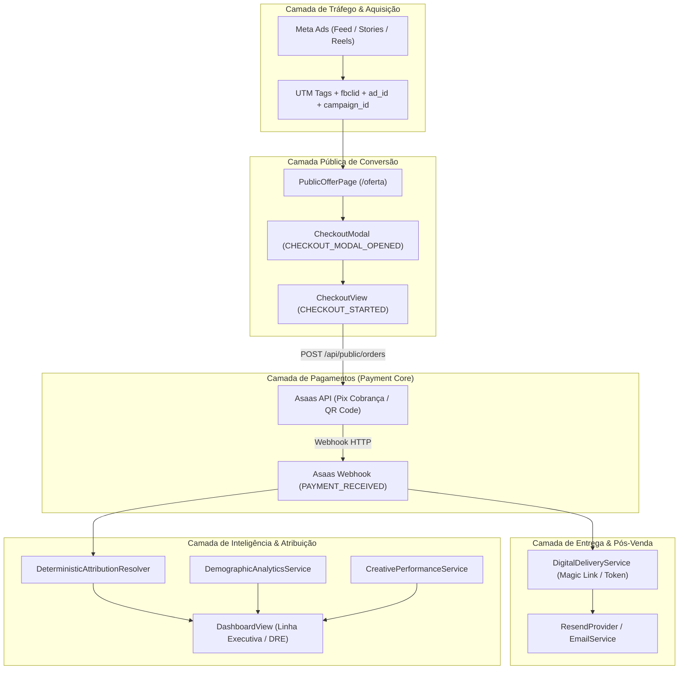
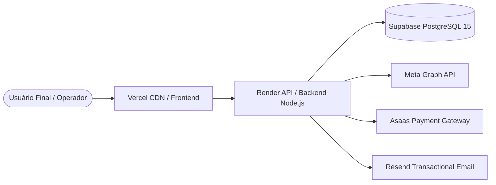

# 01 — SYSTEM ARCHITECTURE

## 1. Visão Macro da Arquitetura

O ecossistema NORQVA é composto por 3 camadas principais:
1. **Frontend (SPA):** React 18 + TypeScript + Vite + TailwindCSS hospedado na Vercel.
2. **Backend (API REST):** Node.js 20 + Express + TypeScript hospedado no Render (Web Service).
3. **Persistência & Dados:** PostgreSQL hospedado no Supabase, com pooling transacional, triggers e migrations SQL versionadas.

---

## 2. Diagrama de Comunicação e Protocolos

| Origem | Destino | Protocolo | Autenticação / Segurança |
| :--- | :--- | :--- | :--- |
| **Cliente Web** | Frontend Vercel | HTTPS / TLS 1.3 | CDN Vercel Edge |
| **Frontend** | Backend Render | HTTPS / REST | Bearer JWT (Supabase Auth) / Anonymous Session |
| **Backend** | Supabase Postgres | TCP / SSL (`pg` Pool) | Connection Pooling / SSL `rejectUnauthorized: false` |
| **Asaas Gateway** | Backend Render | HTTPS POST Webhook | Header `asaas-access-token` com Constant-Time Comparison |
| **Backend** | Meta Marketing API | HTTPS Graph API v19+ | Bearer `META_ACCESS_TOKEN` |
| **Backend** | Resend API | HTTPS REST | Bearer `RESEND_API_KEY` |

---

## 3. Topologia de Infraestrutura

