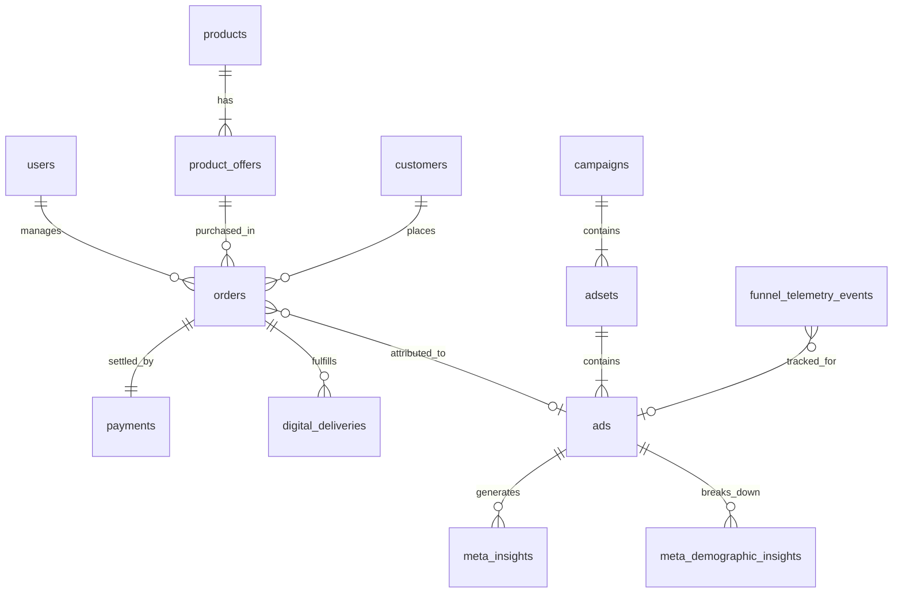

# 04 — DATABASE AND MIGRATIONS

## 1. Visão Geral do Banco de Dados
* **Engine:** PostgreSQL 15 (Supabase).
* **Migration Runner:** `backend/src/db/migrations.ts` e `run_migrations_cli.ts` (execução transacional com controle na tabela `schema_migrations`).
* **Total de Migrations:** 26 migrations versionadas sequencialmente.

---

## 2. Inventário Completo de Migrations

| Migration | Arquivo | Objetivo & Tabelas / Índices Criados |
| :--- | :--- | :--- |
| **001** | `001_initial_schema.sql` | Criação do schema base (`users`, `campaigns`, `adsets`, `ads`, `meta_insights`). |
| **002** | `002_add_performance_source.sql` | Adiciona coluna `performance_source` e rastreabilidade de dados. |
| **003** | `003_add_auth_fields.sql` | Suporte a autenticação Supabase Auth (`supabase_auth_id`, `role`). |
| **004** | `004_sprint2_intelligence.sql` | Tabelas de inteligência de criativos e oportunidades de escala. |
| **005** | `005_sprint2_5_commercial.sql` | Criação das tabelas de comércio: `products`, `product_offers`, `customers`, `orders`. |
| **006** | `006_sprint2_5_payments.sql` | Tabela `payments` com suporte a Asaas Pix, QR Code e status de liquidação. |
| **007** | `007_sprint2_5d_deliveries.sql` | Tabela `digital_deliveries` e rastreamento de entregas de infoprodutos. |
| **008** | `008_meta_acquisition_core.sql` | Estrutura central para aquisição Meta Ads e parâmetros UTM de rastreio. |
| **009** | `009_meta_mutating_core.sql` | Logs de auditoria para operações de escrita/mutação em anúncios. |
| **010** | `010_performance_indexes.sql` | Índices de performance para queries analíticas e filtros temporais. |
| **011** | `011_commercial_funnel_telemetry.sql` | Tabela `funnel_telemetry_events` para registrar passos do visitante no funil. |
| **012** | `012_agentic_foundation.sql` | Tabelas de sessões e execuções para agentes autônomos. |
| **013** | `013_data_provenance_hardening.sql` | Colunas `is_demo` e `data_provenance` para separação rigorosa de dados. |
| **014** | `014_commercial_truth_layer.sql` | Ajustes de consistência financeira e unificação de produtos ativos. |
| **015** | `015_cleanup_preflight_customer.sql` | Sanitização de dados de teste de pré-voo em clientes. |
| **016** | `016_cleanup_additional_preflight_customers.sql` | Expansão da limpeza de registros probe de teste. |
| **017** | `017_cleanup_final_predeploy_probe_customer.sql` | Limpeza final de registros de teste antes do deploy de produção. |
| **018** | `018_order_recovery_tokens.sql` | Tokens de recuperação durável de pedidos e links de acesso. |
| **019** | `019_order_customer_sessions.sql` | Vinculação durável entre sessões de clientes e pedidos gerados. |
| **020** | `020_seed_bolso_blindado_commercial.sql` | Seed do produto comercial *Bolso Blindado* no catálogo. |
| **021** | `021_activate_bolso_blindado_offer.sql` | Ativação da oferta do produto *Bolso Blindado*. |
| **022** | `022_update_bolso_blindado_provenance_to_commercial.sql` | Promoção da proveniência do produto para `COMMERCIAL_PRODUCTION`. |
| **023** | `023_market_intelligence_core_v1.sql` | Tabelas de inteligência de mercado: `market_ads`, `market_clusters`, `market_test_queue`. |
| **024** | `024_meta_demographic_insights_core_v1.sql` | Tabela `meta_demographic_insights` (idade, gênero, spend, impressões, cliques). |
| **025** | `025_add_checkout_modal_opened_funnel_event.sql` | Atualização da constraint de `event_name` para suportar `CHECKOUT_MODAL_OPENED`. |

---

## 3. Principais Tabelas e Relacionamentos

