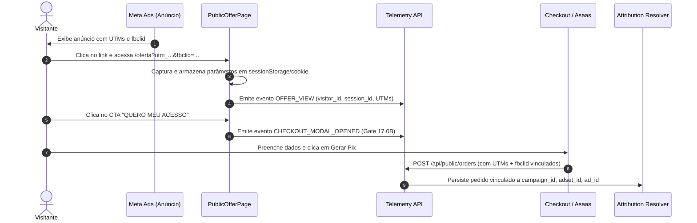

# 07 — META ADS AND ATTRIBUTION

## 1. Pipeline de Aquisição e Rastreabilidade Meta Ads

A rastreabilidade da NORQVA opera no modelo **First-Party Deterministic Attribution**:

---

## 2. Ingestão Diária e Semântica de Período (Gate 16.4e / 16.4j)
* **Ingestão Diária:** Sincroniza dados particionados por `date` na tabela `meta_insights`.
* **Inclusão do Dia Corrente:** O sincronizador consulta a Graph API incluindo `today` para refletir o gasto e cliques em tempo real no dashboard.
* **Idempotência:** Migrations e queries de sincronização utilizam `ON CONFLICT (ad_id, date) DO UPDATE` para garantir que re-sincronizações não dupliquem métricas.

---

## 3. Inteligência Demográfica (Gate 16.6G)
* **Estrutura:** Tabela `meta_demographic_insights` particionada por `age` (ex: `18-24`, `25-34`, `35-44`, etc.) e `gender` (`male`, `female`, `unknown`).
* **Conexão com a UI:** Endpoint `GET /api/intelligence/demographics` consolida os dados agregados para renderização de pirâmides e gráficos demográficos.

---

## 4. Guardrails de Mutação Meta Ads (Safe Lock)
* **Variável de Controle:** `META_MUTATION_ENABLED=false` em produção.
* **Comportamento:** Qualquer tentativa de chamada a endpoints de criação/alteração de campanhas ou anúncios é bloqueada ou executada em modo DRY-RUN, prevenindo alterações automáticas de orçamento ou público sem homologação humana explícita.
