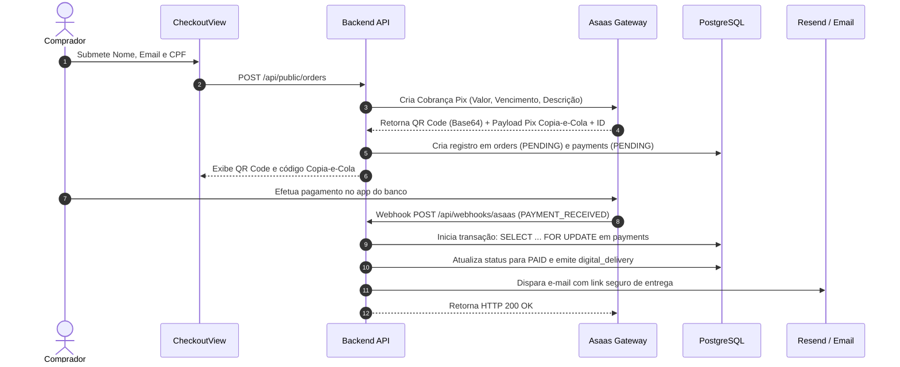

# 08 — PAYMENTS AND FULFILLMENT

## 1. Motor de Pagamentos (Payment Core - Asaas Pix)

O fluxo de liquidação financeira é 100% determinístico e auditável:

---

## 2. Garantias de Idempotência e Segurança Financeira
1. **Idempotência de Webhook:** Se o Asaas reenviar o webhook de confirmação, a transação valida se o pedido já está `PAID` e encerra sem reprocessamento redundante.
2. **Lock Transacional:** Uso explícito de bloqueio de linha em banco de dados para evitar condições de corrida em confirmações simultâneas.
3. **Validação de Assinatura:** O webhook rejeita qualquer requisição cujo token de acesso do cabeçalho não confira com `ASAAS_WEBHOOK_AUTH_TOKEN`.

---

## 3. Entrega Digital & Recuperação Durável (Fulfillment)
* **Tokens de Entrega:** Cada pedido pago gera um token aleatório criptográfico com tempo de expiração configurável (`DELIVERY_TOKEN_TTL_HOURS`).
* **Recuperação de Acessos:** O cliente pode informar seu e-mail em `/recuperar-acesso` e receber um link novo com token temporário para acessar seus produtos comprados sem necessidade de login.
